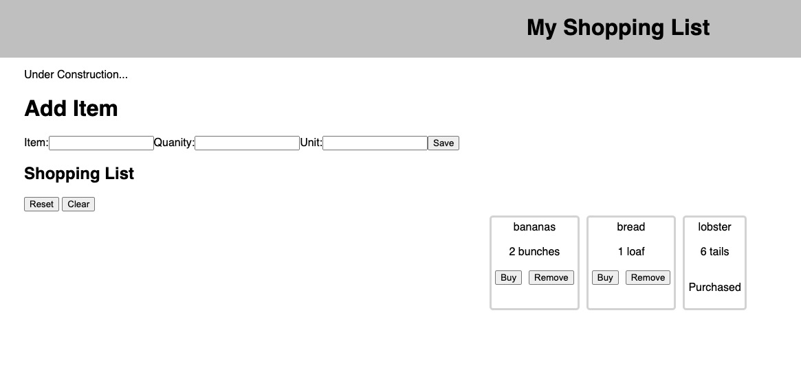

# React Shopping List

## Description

Duration: 1 day

This application allows the user to keep track of a list of grocery items to not forget while shopping. This allows the ability to edit the list and mark if purchased or no longer needed. Also, the full list can be reset for the next shopping spree.

Additional README details can be found [here](https://github.com/PrimeAcademy/readme-template/blob/master/README.md).

## Screenshot
[]
[]

## Technologies
React
Javascript
Node
HTML/CSS

Created by:
Sean Kimbrough
Steven Gangl
Ryan Weispfenning
Thomas Vargas

